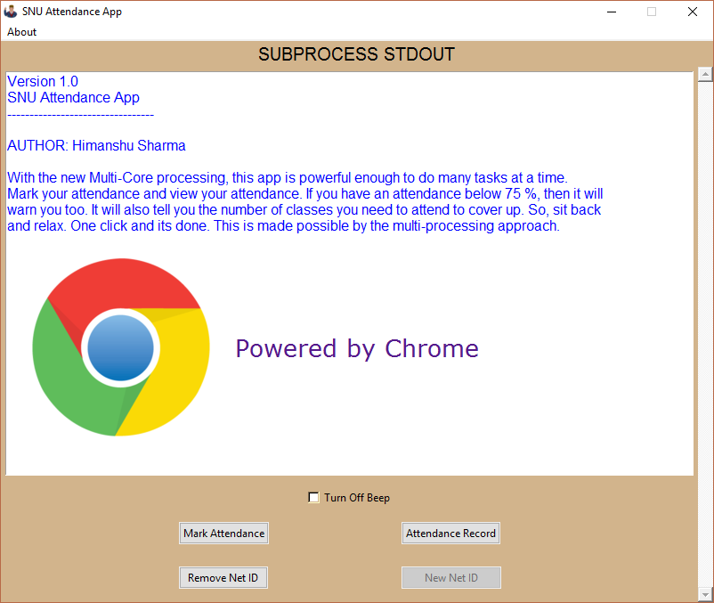
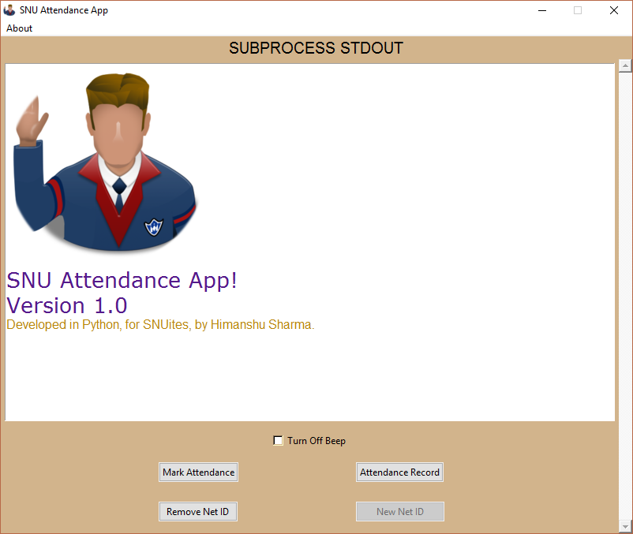

# SNU Attendance App

The SNU Attendance App is focused on making attendance marking process automated and easing user interaction with the browser. Whenever the attendance is initiated, the student would have to go to SNULinks and open attendance page, login and then finally mark the attendance and logout. The process become even more irritating if you find that the attendance is not initiated :angry:. You would have to logout then, wait for the professor to initiate and then login again and do the same hectic process. What if all this is done by one single click??

Thats when this app comes into picture. You donwload it, launch it and just click "Mark Attendance" and its done. Do not want to wait for attendance to be marked and at the same time want to view your attendance record?? No problem, it can do many tasks simultaneously, thats where the threading plays a role :anguished:.

Why not have a look at the source code and convince yourself that how amazing this app is!!

The app can do the following.
* Mark the attendance
* View attendance record
* Warn you on short attendance
* Classes needed to cover up

**The app is currently available for Ubuntu and Windows.**

## Screenshots

**These screenshots are what you would see on Windows.**
**To install the app on Windows, download the [INSTALLER](https://github.com/hmnhGeek/SNU-Attendance-App/blob/master/SNU%20Attendance%20App%20(Upgraded%20Website).exe).**

## Disclaimer
The app is subjected to the changes in the website.
